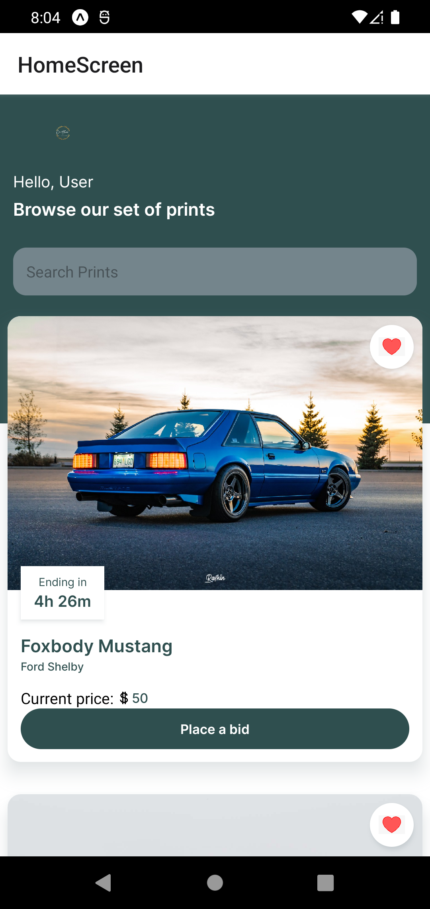
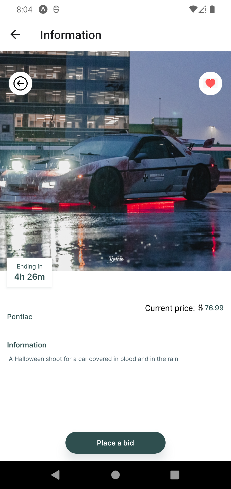
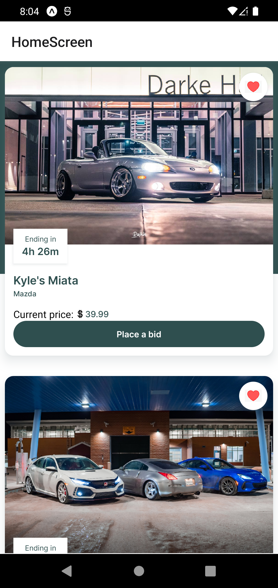

# Showcase




# Description
Car Network is a real-time bidding application designed for photographers to sell prints of their pictures to consumers. Users bid on a picture that they like and once the time goes down to zero, the user with the highest bid gains the rights to purchase the print!

# Technologies Used
To maintain the simplicity and overall effectiveness of this application, the usage of technologies was kept to a minimum. Following are the techonologies used in the application: 
* React Native
* React Navigation
* React Native Gesture Handler
* React Native Reanimated
* React Native Safe Area Context
* React Native Screens

# Table of Contents
* [Installation Instructions](#Installation-Instructions "Goto Installation Instructions")
* [Operating Instructions](#Operating-Instructions "Goto Operating Instructions")
* [How to use the App](#How-to-use-the-App  "Goto How to use the App ")
* [Directory Structure](#Directory-Structure "Goto Directory Structure")
* [Relevant files to mention](#Relevant-files-to-mention "Goto Relevant files to mention")
* [Features](#Features "Goto Features")
* [Bug Lists](#Bug-Lists "Goto Features")
* [Planned Features to add](#Planned-Features-to-add "Goto Planned Features to add")
* [Copyright and License](#Copyright-and-License "Goto Copyright and License")
* [Contact Information and Support](#Contact-Information-and-Support "Goto Contact Information and Support")
* [Credit and Acknowledgments](#Credit-and-Acknowledgments "Goto Credit and Acknowledgments")

# Installation Instructions
If you would like to install the application on your computer, following are the instructions on how to do so:
**Fair warning however:** based on my experience from creating this project, I have faced numerous bugs when it came to using **npm** instead of **yarn** so I would highly suggest using the latter. As well as making sure that the expo-cli and the package manager for yarn/npm is up to date.
If expo-cli is not installed on your machine, use the following code on your terminal:
```
$ yarn global add expo-cli
```
Or you can use: 
```
$ npm install --global expo-cli
```
To clone the application into your own directory:
```
$ git clone https://github.com/FaisalMir/car-network.git
```
To install the dependencies setup for the package.json:
```
$ yarn install
```
Or you can use:
```
$ npm install
```

# Operating Instructions 
After all the dependencies and libraries are installed from the installtion instructions, the following command has to be used to run the application:
```
$ yarn start
```
Or you can use:
```
$ npm start
```
You can run the application via the localhost option. But to run it via an Android Virtual Device, you can download and install Android Studio to do so: https://developer.android.com/studio

# How to use the App
An app developed in React Native as a final project for CS 455 in the University of Regina

# Directory Structure
```
├───assets
│   ├───fonts
│   ├───icons
│   └───images
├───components
│   ├───BidsInfo.js
│   ├───Button.js
│   └───FocusedStatusBar.js
│   ├───HomeHeader.js
│   └───InfoDes.js
│   └───PhotoCard.js
│   ├───PicInfo.js
│   └───index.js
├───constants
│   ├───PhotoData.js
│   ├───assets.js
│   └───index.js
│   ├───theme.js
├───screens
│   ├───HomeScreen.js
│   ├───Information.js
├───App.js
```

# Relevant files to mention

| File Name | Description |
| ------------- | ------------- |
| HomeScreen.js  | Content Cell  |
| Information.js  | Content Cell  |
| BidsInfo.js  | Content Cell  |
| InfoDes.js  | Content Cell  |
| PhotoCard.js  | Content Cell  |
| PicInfo.js  | Content Cell  |
| PhotoData.js  | Content Cell  |
| assets.js  | Content Cell  |
| theme.js  | Content Cell  |

# Features
An app developed in React Native as a final project for CS 455 in the University of Regina

# Bug Lists
An app developed in React Native as a final project for CS 455 in the University of Regina

# Planned Features to add
I have a lot of plans for features that I would like to add overtime since it would make the app more complete and much more useable. And I do believe that the concept is something that would appeal to a lot of people looking to decorate their rooms and such with prints.

* User registration and login screen: At the moment with how the app is, it is a default user rather than the user being able to create their own account and having personalized settings. With the help of a database software such as Firebase, this could be integrated into the app
* The ability to post a print for bid: After the integration of the user registration, adding the ability to post a bid for auction would be nice. By integrating the ability to upload a picture, the starting bid and the duration the bid would run for.
* Wallet: users can have money in the app either in terms of real-world money or cryptocurrency to take part in bids.
* Sound effects: adding sound effects such as when a user places a bid or posts an action or even placing a bid; sound effects can add a lot to the user experience and it allows the user to have a pleasant experience as well.
* Light mode and dark mode: enabling the ability to switch between light mode and dark mode in the app in the settings menu.

# Copyright and License
Copyright (C) 2022 Car Network

# Contact Information and Support
For contact information and any support, my email is: fmu324@uregina.ca

# Credit and Acknowledgments
* For anything regarding React Native, I used this: https://reactnative.dev/docs/getting-started
* The entirety of the project was coded on Visual Studio Code: https://code.visualstudio.com/
* For getting started on developing on VS Code and having the right dependencies, I used this: https://blog.expo.dev/expo-cli-2-0-released-a7a9c250e99c
* For gaining access to a Android Virtual device as I coded, I used Android Studio: https://developer.android.com/studio
* As well as these other sources:
  * All the pictures for the cars were taken by me: 
  https://www.rafhin.com/
  * Heart Icon
[https://www.kindpng.com/imgv/bmwbo_love-heart-clipart-royalty-free-heart-hd-png/](https://www.kindpng.com/imgv/bmwbo_love-heart-clipart-royalty-free-heart-hd-png/)
  * Back button icon
 [https://www.flaticon.com/free-icon/back-button_93634](https://www.flaticon.com/free-icon/back-button_93634)
   * Dollar sign icon
 https://simple.m.wikipedia.org/wiki/File:Double-barred_dollar_sign.svg
   * How to create a searchbar:
   https://www.youtube.com/watch?v=B7dn6YlWniI
    * Bidding app:
      https://www.youtube.com/watch?v=UG1pPq8gl_c
    * Guidline for basic React Native coding:
		https://www.youtube.com/watch?v=6euMQsGt7Qs
    * Inspiration behind the overall look and feel of the app
https://www.youtube.com/watch?v=_ivIUCSOZ78&t=5482s
    * Tutorial I followed for setting up the Android Studio virtual device
https://www.youtube.com/watch?v=x_lvdLil0Fk
